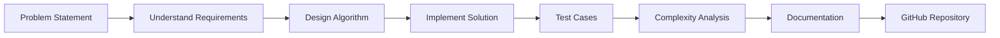

# ⚡ CC LAB EXPERIMENTS HUB ⚡

<div align="center">


<br>


</div>

---

## 🌌 About This Repository

This repository serves as a centralized collection of all experiments performed during the **CC (Competitive Coding) Laboratory** at **Chandigarh University**.

The primary objective of this repository is to document practical implementations, coding solutions, algorithmic approaches, and complexity analysis developed throughout the semester.

Each experiment is carefully structured to provide:

✨ Clear Problem Understanding

⚡ Efficient Algorithm Design

🧠 Logical Problem Solving

💻 Clean Code Implementation

📈 Complexity Analysis

🚀 Industry-Oriented Coding Practices

---

## 👨‍💻 Developer Profile

```yaml
Name: Suryakant Kumar
Branch: Computer Science Engineering (AI & ML)
University: Chandigarh University
Role: Student Developer
Interests:
  - Artificial Intelligence
  - Machine Learning
  - Competitive Programming
  - Full Stack Development
  - Open Source
```

---

## 🎯 Repository Mission

```text
Transform Problems
        ↓
Design Algorithms
        ↓
Write Efficient Code
        ↓
Analyze Complexity
        ↓
Learn & Improve
        ↓
Become Better Every Week
```

---

## ⚙️ What You'll Find Here

<table>
<tr>
<td align="center">📝</td>
<td><b>Aim</b> — Objective of the experiment</td>
</tr>

<tr>
<td align="center">🧠</td>
<td><b>Algorithm</b> — Step-by-step solution approach</td>
</tr>

<tr>
<td align="center">💻</td>
<td><b>Code</b> — Complete implementation</td>
</tr>

<tr>
<td align="center">⚡</td>
<td><b>Time Complexity</b> — Performance analysis</td>
</tr>

<tr>
<td align="center">📦</td>
<td><b>Space Complexity</b> — Memory usage analysis</td>
</tr>
</table>

---

## 🏆 Learning Objectives

<div align="center">

| Skill                 | Focus Area            |
| --------------------- | --------------------- |
| 🧩 Problem Solving    | Logical Thinking      |
| ⚡ Algorithms          | Optimization          |
| 📚 Data Structures    | Efficient Storage     |
| 💻 Programming        | Clean Implementation  |
| 🚀 Competitive Coding | Interview Preparation |

</div>

---

## 🌟 Laboratory Guidance

<div align="center">

### 👩‍🏫 Faculty Mentor

**Anchita Ma'am**

*"Learning by implementing, improving by practicing."*

</div>

---

## 📊 Repository Workflow



---

## 🚀 Tech Stack

<div align="center">


</div>

---

## 🌠 Coding Philosophy

```python
while learning:
    practice()
    debug()
    improve()

print("Keep Coding 🚀")
```

---

## 📈 Growth Mindset

> Every experiment in this repository represents a step toward becoming a better problem solver, developer, and engineer.

---

<div align="center">

## ⭐ If you like this repository, don't forget to star it!


### 🚀 Made with Passion by Suryakant Kumar

</div>
